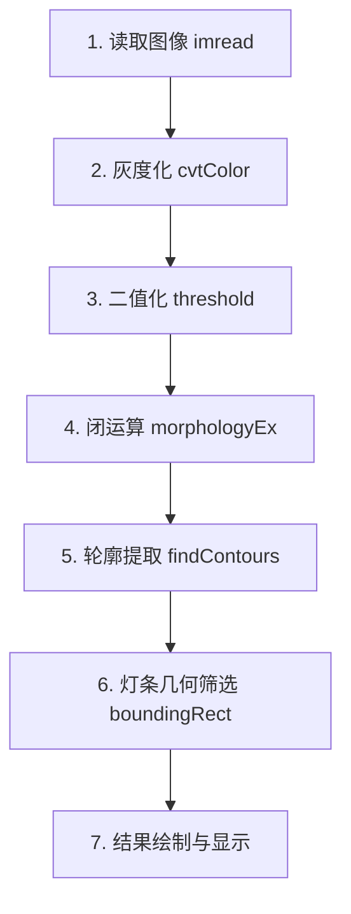

# RoboMaster 装甲板灯条识别模块 (Light Bar Detection)

本项目是基于 **OpenCV (C++)** 实现的机甲大师（RoboMaster）装甲板灯条检测常规流水线。通过传统的图像处理算法（灰度化、二值化、形态学操作、轮廓筛选），快速准确地提取出图像中的潜在灯条目标。

---

## 🛠 功能特点

* **高效预处理**：结合灰度化与高阈值二值化，有效提取高亮灯条区域。
* **形态学优化**：采用闭运算（Closing）消除灯条内部噪点并连接断裂部分。
* **多维度筛选**：基于轮廓的长宽比（Aspect Ratio）**与**面积（Area）进行双重过滤，剔除环境反光等杂散干扰。
* **实时可视化**：提供完整的流水线图像输出（原图、灰度图、二值图、检测结果图），便于调试。

---

## 📂 项目结构

```text
.
├── CMakeLists.txt          # CMake 构建配置文件
├── LICENSE                 # 许可证文件（仅限非商业研究使用）
├── README.md               # 项目说明文档
├── main.cpp                # 装甲板识别核心源代码
└── Resources/
    ├── armor.jpg           # 测试使用的装甲板样本图片
    └── result.jpg          # 运行后的识别结果截图

```

---

## 🚀 算法流水线 (Pipeline)

代码的核心处理流程如下：



---

## 📄 核心代码展示 (Source Code)

以下为项目的核心实现代码 `main.cpp`：

```cpp
#include <opencv2/opencv.hpp>
#include <opencv2/highgui.hpp>
#include <opencv2/imgproc.hpp>
#include <iostream>

using namespace cv;
using namespace std;

int main()
{
    // 1. 图像读取与合法性校验
    string img_path = "Resources/armor.jpg";
    Mat img = imread(img_path);
    if (img.empty())
    {
        cout << "Error: Image load failed!" << endl;
        return -1;
    }

    // 2. 图像预处理
    Mat img_gray;
    cvtColor(img, img_gray, COLOR_BGR2GRAY);

    Mat img_binary;
    threshold(img_gray, img_binary, 200, 255, THRESH_BINARY);

    Mat kernel = getStructuringElement(MORPH_RECT, Size(3, 3));
    morphologyEx(img_binary, img_binary, MORPH_CLOSE, kernel);

    // 3. 轮廓检测与灯条筛选
    vector<vector<Point>> contours;
    vector<Vec4i> hierarchy;
    findContours(img_binary, contours, hierarchy, RETR_EXTERNAL, CHAIN_APPROX_SIMPLE);

    Mat img_result = img.clone();
    for (size_t i = 0; i < contours.size(); i++)
    {
        Rect rect = boundingRect(contours[i]);
        double aspect_ratio = (double)rect.height / rect.width;

        // 几何特征筛选：细长型且面积足够大
        if (aspect_ratio > 3 && rect.area() > 50)
        {
            rectangle(img_result, rect, Scalar(0, 255, 0), 2);
        }
    }

    // 4. 结果可视化
    imshow("Original Image", img);
    imshow("Grayscale Image", img_gray);
    imshow("Binary Image", img_binary);
    imshow("Light Bar Detection", img_result);

    waitKey(0);
    destroyAllWindows();
    return 0;
}

```

---

## 📺 运行结果展示 (Results)

程序运行后会进行二值化分割与几何筛选，最终成功识别出装甲板两侧的**绿色灯条**，效果如下：


*(上图展示了经过长宽比与面积筛选后，成功圈出的灯条目标)*

---

## 💻 环境要求

* **操作系统**：Linux (Ubuntu 18.04/20.04/22.04) 或 Windows 10/11
* **编译器**：支持 C++11 及以上的编译器 (GCC / MSVC)
* **核心依赖**：OpenCV 4.x

---

## 🔨 编译与运行指南

### 1. CMakeLists.txt 配置参考

若要在本地编译，请在根目录下创建 `CMakeLists.txt` 并写入以下内容：

```cmake
cmake_minimum_required(VERSION 3.10)
project(ArmorDetector)

set(CMAKE_CXX_STANDARD 11)

# 寻找 OpenCV 库
find_package(OpenCV REQUIRED)
include_directories(${OpenCV_INCLUDE_DIRS})

# 添加可执行文件
add_executable(ArmorDetector main.cpp)

# 链接 OpenCV 库
target_link_libraries(ArmorDetector ${OpenCV_LIBS})

```

### 2. 编译步骤 (Linux 终端)

```bash
mkdir build && cd build
cmake ..
make
./ArmorDetector

```

---

## 🎯 下一步优化方向 (To-Do)

* [ ] **灯条匹配**：对检测到的多个灯条进行两两配对，合成真正的装甲板。
* [ ] **颜色识别**：在二值化前利用通道相减法（如 $R - B$）进行红蓝色方阵营分类。
* [ ] **PNP 位姿估计**：结合 `solvePnP` 算法获取装甲板相对于相机的具体三维坐标。

---

## 👥 作者与贡献者 (Authors)

Zaoyx
---

## 📄 许可证与使用限制 (License & Restrictions)

本项目采用 **[CC BY-NC-SA 4.0](https://creativecommons.org/licenses/by-nc-sa/4.0/deed.zh)** (知识共享-署名-非商业性使用-相同方式共享 4.0 国际) 协议进行特殊授权许可。

### ⚠️ 严格使用限制：

1. **仅限学习与研究**：本软件及其源代码**仅允许用于个人学习、学术研究、技术交流或 RoboMaster 赛事备赛调试**。
2. **禁止商业用途**：**严禁**将本项目的任何代码、算法或衍生作品用于任何商业盈利行为、商业项目外包或付费教程中。
3. **署名与保持开源**：在引用或基于本代码进行二次开发时，**必须保留原作者的版权声明**，且衍生代码**必须以相同的非商业协议**进行开源。
